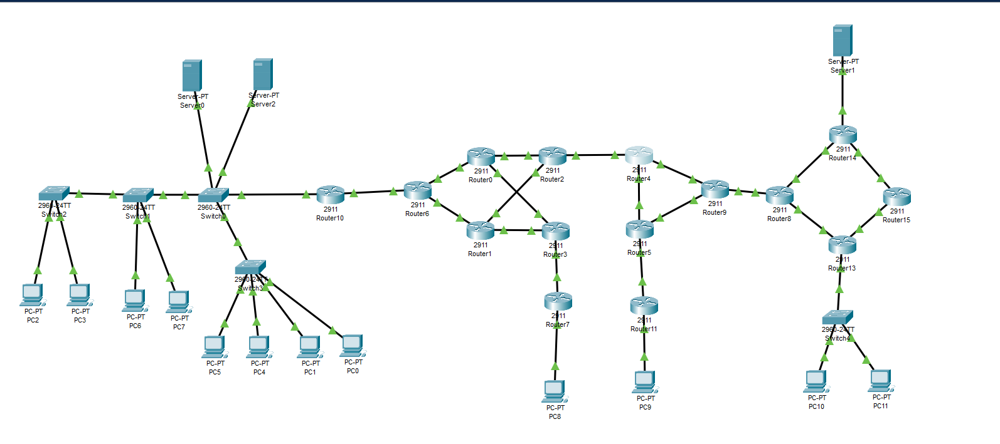

# Advanced ISP & Customer Network Simulation

This repository contains a Cisco Packet Tracer project that models a scenario where an Internet Service Provider (ISP) provides connectivity and services to several distinct customer networks. The topology is designed to demonstrate and test a wide array of fundamental and advanced networking concepts in a multi-layered environment.

The architecture is divided into an ISP core and four unique customer sites, each with different requirements and configurations.

### Core Architecture

*   **ISP Core (AS 100):** A redundant backbone running **OSPF Area 0** on a public Class A address space. It serves as the transit network for all customer traffic.
*   **Customer A (AS 200):** A large enterprise with its own public Class C IP block and Autonomous System. It connects to the ISP via **eBGP** and utilizes **route redistribution** to announce its internal networks. It also hosts public-facing WWW, SMTP, and DNS servers.
*   **Customer B:** A large private network using **NAT** at its gateway router (`Router10`) to access the internet. This site also includes local servers, VLANs for segmentation, and relies on **DHCP** for host configuration and **ACLs** for security.
*   **Customers C & D:** Two smaller, separate customers on private IP schemes who rely on the ISP's gateway routers for **NAT** services to gain internet access.

### Key Features & Technologies Implemented

*   **Advanced Routing:** Implementation of OSPFv2 in the ISP backbone and eBGP for routing between autonomous systems.
*   **Route Redistribution:** Configuration of two-way redistribution between OSPF and BGP on the network edge.
*   **Network Address Translation (NAT):** Use of NAT Overload (PAT) to enable internet access for three separate private customer networks.
*   **Dynamic Host Configuration Protocol (DHCP):** DHCP server configuration on gateway routers to automate IP addressing for end-user PCs.
*   **Layer 2 Security & Segmentation:** VLAN implementation to logically separate traffic within a customer LAN.
*   **Access Control Lists (ACLs):** Application of standard and extended ACLs to filter traffic and secure the network.

### Network Topology Diagram

